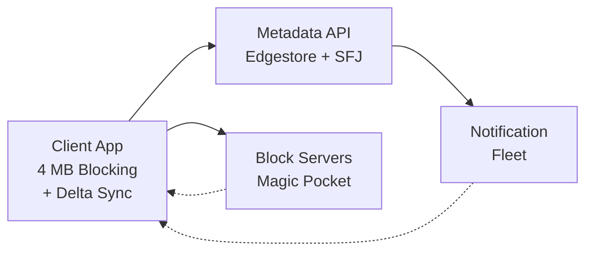
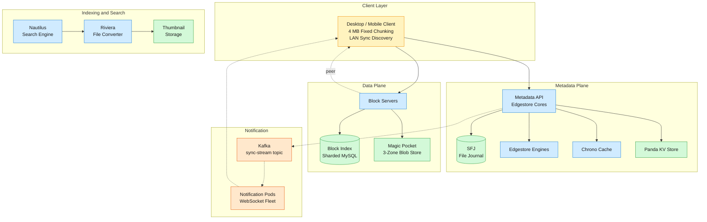
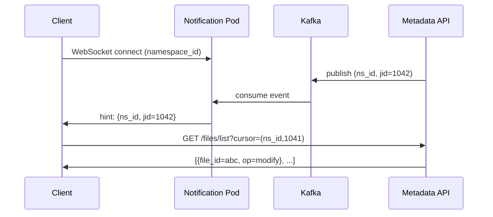

## 1. Problem
Dropbox synchronizes files across devices for 700M+ registered users, serving individuals and teams with shared folders. A user edits a file on one machine; that change propagates to all authorized devices within seconds, surviving network partitions, clock skew, and concurrent edits. The system stores over an exabyte of user data, deduplicating at the block level so two users who upload the same file store it once. Upload and download bandwidth dominate cost — a 100-byte edit inside a 4 GB file must not re-upload the file.

## 2. Requirements
Functional
- FR1: Upload files with deduplication.
- FR2: Sync files across all devices and download on demand.
- FR3: Resolve write-write conflicts, keep both versions.
- FR4: Share files and folders with permissioned access.
- FR5: Search files by name and content.
- FR6: Serve thumbnails and previews.
Non-functional
- NFR1: 99.999999999% (11 nines) annual durability — at most one lost block per 10 EB·year.
- NFR2: 99.99% availability for reads and writes.
- NFR3: Changes propagate to all devices within 30 seconds.
- NFR4: Per-edit sync bandwidth ≤ 1 block (4 MB) regardless of file size — a 1 KB edit to a 1 GB file transfers at most 4 MB.
- NFR5: Support 700M+ registered users with 50M daily actives across desktop, mobile, and web clients.
Out of scope: real-time collaborative editing (Google Docs-style), file format conversion, video transcoding and streaming.
## 3. Back of the envelope
- Block size: 4 MB fixed at 1 EB storage yields ~250M unique blocks. At 8 KB CDC, metadata would be 500× larger with minimal dedup gain for document+media workloads.
- Cold storage savings: Erasure coding LRC-(12,2,2) converts blocks from 2× replication to 1.33× overhead. On 1 EB of user data: 1 EB × (2.0 − 1.33) = 670 PB saved raw disk.
- Notification memory: 50M concurrent users × 10 KB per WebSocket = 500 GB RAM fleet-wide. At consistent-hash affinity, one namespace-change fans out to one pod, not 50M.
- Storage estimate: 700M registered users × ~10 GB average stored per user ≈ 7 EB user data. With 1.33× erasure-code overhead → ~9.3 EB physical. At 50M DAU with ~20 MB net new data per active user per day → ~1 PB/day ingest, ~365 PB/year organic growth.
- Read/write ratio: ~10:1. Reads dominate — sync pulls (delta lists + block fetches), thumbnail loads, search queries, and on-demand downloads far outnumber uploads. Block Server read throughput: ~10 PB/day vs ~1 PB/day write. Metadata API: ~50K writes/sec (commit) vs ~500K reads/sec (list, search, block-index lookups).
## 4. Entities & API
```sql
File {
  file_id:     uuid PK
  namespace_id:bigint PK ← shard key; all files in a namespace co-located
  path:        text
  blocklist:   blob[]    ← ordered SHA-256 hashes, one per 4 MB block
  content_hash:blob      ← hash of the blocklist itself
  revision:    bigint    ← monotonic per file, used for conflict detection
  is_deleted:  boolean
  modified_at: timestamp
}

Journal {
  namespace_id:bigint PK ← shard key
  journal_id:  bigint PK ← monotonic per namespace; cursor is (ns_id, jid)
  file_id:     uuid
  op:          enum      ← create | modify | delete | move
  timestamp:   timestamp
}

Block {
  block_hash:  blob PK ← SHA-256 of 4 MB content
  size:        bigint
  ref_count:   integer ← active file revisions referencing this block
  storage_tier:enum    ← warm | cold
}

UserEntity {
  user_id:bigint PK
  email:  text
}

FolderEntity {
  folder_id:bigint PK
  name:     text
}

UserFolderAssoc {
  user_id:           bigint FK ← composite key with folder_id
  folder_id:         bigint FK
  access_type:       enum      ← owner | editor | viewer
  access_inheritance:enum      ← inherit | no_inherit
}
```
API
- POST /files/commit — upload blocklist and create/replace a file revision; returns (file_id, revision)
- POST /blocks/put — upload a raw 4 MB block; idempotent (SHA-256 collision is a no-op)
- GET /blocks/:block_hash — download a block; served by nearest Block Server or LAN peer
- GET /files/list?cursor=<opaque> — return deltas since the cursor; cursor encodes (namespace_id, journal_id)
- POST /sharing/add_member — add a user to a folder with a role; creates UserFolderAssoc
- POST /search/query — full-text search across authorized namespaces; returns ranked file list
- GET /tbatch?paths=<p1>,<p2>,... — fetch up to 20 thumbnails in one chunked-transfer-encoding response
## 5. High-Level Design

FR1: Upload a file
Components: Client chunker, Metadata API (Edgestore), Block Index (sharded MySQL), Block Servers, Magic Pocket, SFJ journal.
Flow:
1. Client reads file, splits into fixed 4 MB blocks, computes SHA-256 per block → produces ordered blocklist = [h1, h2, ..., hn]
1. Client calls POST /files/commit with {namespace_id, path, blocklist, parent_revision}
1. Metadata API validates parent_revision matches current (conflict detection), checks Block Index for each hash
1. Server returns need_blocks: [h3, h7] — hashes not yet stored
1. Client uploads missing blocks via POST /blocks/put to nearest Block Server; Block Server writes to Magic Pocket, inserts into Block Index
1. Client retries POST /files/commit with same payload — Metadata API atomically writes new file row + journal entry, increments journal_id
1. Metadata API publishes (namespace_id, new_jid) to Kafka → Notification pods push hint to connected clients
Design consideration — atomicity: The commit is the single atomic step. Blocks uploaded in step 5 but never committed become orphaned — their ref_count is 1 but no file revision references them. A GC compaction job in Magic Pocket sweeps orphaned blocks (ref_count = 0 after verifying no active file references them). The commit also doubles as conflict detection: if parent_revision in the request doesn't match the current revision on the file, the server returns 409 Conflict and rejects (see FR3).
```sql
-- Commit in SFJ's namespace shard
BEGIN;
UPDATE files SET revision = revision + 1, blocklist = $new_blocklist,
       content_hash = $content_hash, modified_at = NOW()
 WHERE file_id = $file_id AND namespace_id = $ns AND revision = $parent_rev;
INSERT INTO journal (namespace_id, journal_id, file_id, op, timestamp)
 VALUES ($ns, next_jid, $file_id, 'modify', NOW());
COMMIT;
```
FR2: Sync and download
Components: Client cursor tracker, Notification fleet, Metadata API, SFJ, Block Index, Block Servers, LAN Sync peers.
Flow:
1. Client maintains per-namespace cursor (namespace_id, last_processed_jid) in local state
1. Client holds persistent WebSocket to its affinity-assigned notification pod
1. On any file change in the namespace, notification pod pushes (namespace_id, latest_jid) — ~100 bytes
1. Client receives hint, calls GET /files/list?cursor=<encoded_ns_jid> → server range-scans SFJ journal for entries where journal_id > last_processed_jid
1. For each changed file, client fetches current blocklist from SFJ file row
1. Client checks local block cache: for each missing hash, tries LAN Sync peer first, falls back to GET /blocks/:hash from Block Server
1. Client reconstructs file by concatenating blocks in blocklist order
Design consideration — cursor vs mtime: The journal ID is a monotonically increasing integer per namespace, never a wall clock. This eliminates clock skew, time zone, and NTP drift as failure modes. A client disconnected for 12 hours restarts with its last JID and catches up in one range scan. The cursor is opaque to clients — server encodes it as base64(namespace_id || journal_id) and clients treat it as a cookie. The absence of file data in the WebSocket push keeps per-connection memory at ~10 KB.
The same block-fetch mechanism (GET /blocks/:hash) serves both automatic sync and on-demand download — sync is triggered by WebSocket notification, download by explicit user request (e.g., marking a file 'available offline' or accessing a selectively-synced file).
FR3: Resolve write-write conflicts
Components: SFJ commit path, conflict-detection logic in Metadata API, client rename logic.
Flow:
1. Client A commits revision N+1 with parent_revision = N → succeeds, server sets revision = N+1
1. Client B (stale) commits revision N+1' with parent_revision = N → server sees current revision = N+1 ≠ N, returns 409 Conflict
1. Client B receives 409, renames its local file to filename (conflicted copy - Device B - 2026-06-27).ext
1. Client B calls POST /files/commit with the conflict-copy path and its blocklist as a new file entry
1. Both versions preserved; user resolves manually
Design consideration — never merge bytes: Dropbox does not understand file content — it could be a PDF, .psd, .xlsx, or raw binary. Merging bytes without format awareness produces corrupted files. The "conflicted copy" strategy trades manual user effort for zero silent data loss. OneDrive and iCloud Drive use the same pattern. For structured document formats (Dropbox Paper), operational transforms handle merging because the server understands the document model.
FR4: Share a folder
Components: Edgestore (Entity + Association graph), CAPE event pipeline, cert rotation service, shared link generator.
Flow:
1. Owner calls POST /sharing/add_member(folder_id, user_id, access_type="editor") → Edgestore inserts UserFolderAssoc
1. Folder membership becomes queryable bidirectionally: all users in a folder (SELECT user_id WHERE folder_id=?) or all folders for a user (SELECT folder_id WHERE user_id=?)
1. Access control on file operations: Metadata API joins UserFolderAssoc on file's namespace → confirms caller has membership
1. On member removal: delete the single UserFolderAssoc row → CAPE event fires → Kafka → cert rotation service rotates the namespace's TLS certificate for LAN Sync
1. Link sharing: POST /sharing/create_link(file_id, access_level, expires_at) → generates a presigned URL with embedded expiry
Design consideration — access inheritance: Folders can inherit parent permissions (access_inheritance = inherit) or break inheritance (no_inherit). Breaking inheritance removes all members inherited from ancestors and sets an explicit ACL. Cert rotation on membership change ensures the ex-member's LAN Sync client cannot fetch blocks for that namespace — the per-namespace TLS certificate is rotated within seconds and the removed client has no valid cert for the new SNI handshake.
FR5: Search
Components: Riviera extraction pipeline, Nautilus inverted index, Octopus query orchestrator, ACL service.
Flow:
1. On file upload, Riviera extracts text (Apache Tika via jail-isolated containers) → writes to document store (forward index)
1. Offline build system constructs inverted index: {token → sorted list of document IDs with positions}
1. Index sharded by namespace partition, pushed to retrieval-engine leaves across replica groups
1. User query arrives at Octopus → queries ACL service for readable namespaces → fans out to all leaf partitions
1. Each leaf searches its inverted-index shard, returns candidate document IDs with BM25 scores
1. Octopus ranks candidates with gradient-boosted ML model (BM25 + recency signals + namespace personalization) → returns top-K results with permission masks applied
Design consideration — built, not bought: At Dropbox's scale (hundreds of billions of documents), no off-the-shelf search engine (SolrCloud, Elasticsearch) was proven in 2015. The custom Nautilus architecture gave full control over machine footprint, partition-to-leaf mapping, and ranking signals — achieving 99.9% availability with p95 latency under 300ms across 1,000+ physical hosts.
FR6: Serve thumbnails and previews
Components: Riviera preview generator, Cannes ML predictor, Preview Storage Servers, batch thumbnail endpoint.
Flow:
1. On file upload, Riviera generates preview at multiple resolutions (256px, 1024px, 2048px) → cached in encrypted Preview Storage by content hash
1. Cannes (gradient-boosted tree classifier) scores every new file: predicts probability of preview request within 60 days
1. High-probability files → pre-warm all resolutions proactively. Low-probability → generate on first request, cache for 30 days
1. Web client calls GET /tbatch?paths=p1.png,p2.png,...,p20.png — a single HTTP request for up to 20 thumbnails
1. Server streams response via chunked transfer encoding, each chunk prefixed with its index: 0: data:image/jpeg;base64,..., 1: data:image/jpeg;base64,...
Design consideration — batch + chunked transfer: Browsers limit concurrent connections per origin (Chrome: 6). A photo gallery with 200 thumbnails would need 34 round-trips serially. The batch endpoint collapses 20 fetches into one connection, and chunked transfer encoding eliminates head-of-line blocking — thumbnails stream as they're read from storage. Versioning thumbnail URLs with the file's content_hash means a new file version is a different URL, not a CDN invalidation. Cannes saved $1.7M/year by avoiding pre-generation of files unlikely to be previewed.
Design consideration — durability: The 11-nines durability target is achieved through three layers of protection. First, every block is replicated across three geographically separated zones (US, Europe, Asia) within seconds of upload — a zone failure loses one replica but two remain. Second, cold storage uses erasure coding LRC-(12,2,2) (§3), which tolerates two simultaneous disk failures per 12-disk group with 1.33× overhead instead of 3× for replication. Third, continuous verification (Pocket Watch) scans all blocks monthly, detecting silent corruption (bit rot, firmware bugs) and repairing from healthy replicas before a second failure compounds the loss. The combination of cross-zone replication, erasure coding, and active verification delivers 11 nines — matching Amazon S3's well-known durability SLA and reflecting the economic reality that losing one block per 10 EB·year is the practical limit of current storage technology.
## 6. Deep dives
### DD1: Chunking and large file upload
Problem. Users upload files up to 50 GB over unreliable connections. A single HTTP POST times out after ~1 hour at 100 Mbps, and any interruption restarts the upload from scratch. Separately, a 100-byte edit to a 4 GB file must not re-upload the entire file — bandwidth cost should be proportional to edit size, not file size.
Approach 1: Fixed-size blocks with delta sync
Split every file into 4 MB chunks at fixed byte offsets. When a file changes, client re-hashes all blocks. Any block whose SHA-256 differs from the previous revision must be uploaded. The delta sync engine then takes each changed block and computes a binary diff between the old and new version: matching byte runs become COPY instructions (offset, length in old block); mismatched regions become LITERAL bytes. The server retrieves the old block from Magic Pocket, applies the delta, and verifies the resulting SHA-256 matches.
- Pro: Simple client logic — no sliding window, no fingerprint tuning. Block index size is predictable: 1 EB / 4 MB = 250M entries. 4 MB is large enough that metadata overhead (~50 bytes per block) is negligible against content size. Delta sync inside the block captures intra-block edits — a 100-byte change transmits ~200 bytes of delta.
- Con: Any insertion or deletion shifts all subsequent fixed boundaries, causing every downstream block's hash to change and trigger a full re-upload of those 4 MB blocks. A 1-byte prepend to a 50 GB file recalculates ~12,800 hashes on the client.
Approach 2: Content-defined chunking (CDC) with Rabin fingerprints
Slide a 48-byte window over the file stream. For each window position, compute a rolling polynomial hash fp = (fp << 1) + GEAR[byte] modulo 2^32. Declare a chunk boundary when fp & MASK == 0, where MASK is tuned for ~4 MB average chunk size. Boundaries are determined by content, not offset — a 1-byte prepend only affects the first chunk boundary.
- Pro: Boundary-shift problem is isolated to the region of the edit. An insertion at byte 1,000 changes only the chunk containing that offset; all downstream chunks keep their boundaries and hashes.
- Con: Boundary starvation — a file region may never hit the fingerprint condition for megabytes (mitigation: force cut at 8 MB max). Boundary thrashing — very frequent matches produce tiny chunks (mitigation: enforce 2 MB minimum, skip fingerprint checks inside the minimum region). Fingerprinting costs ~2–3% of a modern core per 100 MB/s stream. The block index grows proportionally to chunk count — at 8 KB average, the index becomes 500× larger with negligible dedup improvement. Most critically, CDC doesn't help with edits inside a chunk: a 100-byte edit still changes the chunk's hash, and a 4 MB chunk must still be transmitted unless combined with delta sync.
Decision. Approach 1 — fixed 4 MB blocks with delta sync inside changed blocks. CDC is the more elegant answer to the boundary-shift problem, but the boundary-shift problem is rare in the workload: users don't prepend bytes to video files or database snapshots; they edit slides, documents, and spreadsheets where edits are within existing blocks. Delta sync handles the common case (intra-block edits) at ~200 bytes per change. Fixed 4 MB blocks keep the block index at a manageable 250M entries at exabyte scale.
Rationale. At the throughput Dropbox operates, a block's lifecycle cost (SFJ row, Block Index entry, Magic Pocket put, replication, GC) far exceeds the bytes saved by a finer cut. A 4 MB block with delta sync achieves >95% bandwidth reduction for document-editing workloads. The Dropbox production block store uses fixed 4 MB blocks addressed by SHA-256, and their binary diff engine (rsync-style rolling hash over the changed block) captures the small edits that CDC would also capture. For encrypted files (client-side encryption), ciphertext changes completely on any plaintext edit — delta sync and CDC are both ineffective, and the full block must re-upload regardless.
Edge cases. Very large files (VM disk images, database snapshots) with structural changes trigger many block recalculations even with delta sync — these are outliers, handled by the same pipeline. Files with repetitive content (e.g., zero-filled regions) compress well with Broccoli and don't need finer chunking. A pathological file edited with a 4 MB insertion at the start will shift every block boundary — but this pattern is vanishingly rare in real user content.
💡 Block size is an economic decision, not just an algorithmic one. The metadata cost of managing a block (index entry, replication, GC, verification) is roughly constant regardless of block size. At 4 MB, metadata overhead is ~0.001% of stored bytes. Reducing to 8 KB would make metadata overhead ~0.6% — still small, but the block index balloons from 250M entries to 125B, requiring a fundamentally different index architecture. The cost of that infrastructure exceeds the bandwidth saved from finer dedup.
### DD2: Sync protocol
Problem. When a file changes, every authorized device must learn about it and fetch the new data. Naive polling burns client and server resources; naive push risks overloading the notification system. The protocol must handle clients behind NATs, clients offline for days, and millions of concurrent connections — and it must never lose a change.
Approach 1: Periodic polling
Client polls GET /files/list?cursor=... every N seconds.
- Pro: Simplest possible implementation. Server is stateless beyond the journal. Works through any NAT/firewall that allows outbound HTTP.
- Con: 90% of poll requests return "no changes" — wasted bandwidth and server CPU. Increasing interval adds latency; decreasing it thrashes the server. At 50M active clients polling every 30 seconds, that's ~1.7M req/s against SFJ, most of which return empty.
Approach 2: Long-polling
Client opens HTTP connection to /longpoll_delta. Server holds the connection open (up to 120s timeout) until a change occurs in that namespace, then responds with the delta hint. Client immediately reconnects.
- Pro: Zero latency from change to notification — the server pushes on the open connection. Lower aggregate request rate than polling. Dropbox ran long-polling in production for years.
- Con: Each long-poll connection consumes a thread or socket on the server. At 50M clients, that's 50M open TCP connections — feasible with async I/O but no connection multiplexing (one connection per namespace). TCP keepalive overhead at this scale is non-trivial. Reconnection storms after a server restart: every client reconnects simultaneously.
Approach 3: WebSocket hints + cursor-based delta pull
Each client maintains one persistent WebSocket to a notification pod (assigned by consistent hash on namespace_id). On file change, the metadata API publishes (namespace_id, new_jid) to a Kafka topic. The notification pod consumes, looks up which clients care about that namespace, and pushes a ~100-byte hint over the WebSocket. The client then calls the REST endpoint GET /files/list?cursor=... to fetch the actual delta — the notification channel carries hints only, never file content or blocklists.
- Pro: Connection affinity via consistent hash means all clients for the same namespace connect to the same pod — one Kafka event fans out to N local WebSocket connections without cross-pod chatter. The hint is small enough that per-connection memory is ~10 KB. Decouples notification transport from correctness: the cursor is the source of truth; the WebSocket is an optimization. If the WebSocket drops, the client catches up via cursor on reconnect.
- Con: Consistent-hash rebalancing on pod addition/removal moves namespace affinity — clients must reconnect, but cursor ensures no changes are lost during the gap. Reconnection storms after fleet restart (thundering herd): mitigated by exponential backoff with jitter (0.5–30s). Kafka consumer group rebalances during pod scaling cause at-least-once delivery — duplicate hints, deduplicated by the cursor on the client side.
Decision. Approach 3 — WebSocket hints + cursor-based REST pull.
Rationale. This is the pattern Dropbox evolved to (polling → long-polling → WebSocket over 2008–2017) and is the same pattern WhatsApp uses for message delivery: push a "you have new content" hint over a persistent connection, let the client pull the payload. The cursor is what makes this reliable — it's a monotonically increasing integer per namespace that the client tracks locally. A client that loses its WebSocket for 12 hours reconnects, sends its last JID, and catches up in one range scan across the SFJ journal. The WebSocket fleet at 50M concurrent connections costs ~500 GB RAM — manageable at ~7,000 8 GB pods.

Edge cases. WebSocket disconnect while Kafka event is in-flight — client reconnects, cursor catch-up during /list recovers the event. Network partition between metadata API and Kafka — events queue in API outbound buffer, replayed when partition heals. Kafka consumer group rebalance during pod scaling — at-least-once delivery may produce duplicate hints; client's cursor deduplicates (same JID processed twice is a no-op). Client clock is wrong — irrelevant; the journal uses server-assigned monotonic IDs, not timestamps.
### DD3: Sharing model
Problem. A shared folder with 500 members, nested subfolders, and permission inheritance creates a web of access rights. Removing a user must revoke access instantly across all nested objects. Adding a user must propagate permissions downward unless inheritance is explicitly broken. The model must handle these operations at low latency without scanning all objects in the folder tree.
Approach 1: Per-object ACL
Every file and folder stores its own list of (user_id, role) tuples. A shared folder with 500 members and 10,000 files stores 5M ACL rows.
- Pro: Permission check is a single lookup on the target object — fast reads. Simple mental model.
- Con: Inheriting permissions down the tree means copying 500 member entries to every child on creation — 5M writes for a new 10,000-file folder. Breaking inheritance means deleting and rewriting all child ACLs. Auditing "which files can Alice see" requires scanning every file's ACL. Membership changes are O(files). At scale, a folder with 100K files and 1,000 members creates 100M ACL rows — and a single membership change touches all of them.
Approach 2: Capability-based (signed tokens)
Users hold cryptographically signed capabilities per folder. Presenting a valid capability grants access; no central ACL store needed.
- Pro: Fully decentralized — any node can validate access from the token alone. No central ACL database to scale or fail.
- Con: Revocation requires a revocation list (CRL) that every access check must consult, reintroducing a central store. Token renewal and rotation add operational complexity. Most real-world systems that started with capabilities (Tahoe-LAFS, FUSE capability systems) found the revocation problem dominates and eventually introduced a central authority.
Approach 3: Graph-based Entity/Association model (Edgestore)
Users (UserEntity) and folders (FolderEntity) are nodes. Membership is an UserFolderAssoc edge connecting them with a role attribute. Permission check: "does Alice have access to file X?" resolves to "does Alice have any UserFolderAssoc to a FolderEntity that is an ancestor of file X's namespace?" The query traverses folder ancestry (parent_folder_id chain) and checks for a matching association.
- Pro: Membership removal is a single edge deletion — O(1). Bidirectional queries without scanning: "Alice's folders" = all UserFolderAssoc rows where user_id = Alice. "Folder members" = all rows where folder_id = X. Inheritance is explicit: each association has an access_inheritance flag. Breaking inheritance: set access_inheritance = no_inherit on the folder, copy the parent's ACL as explicit associations on each child at break time.
- Con: Ancestry traversal at read time adds latency if the folder tree is deep. Solved by materializing transitively-closed permission sets per user into a cache (Chrono cache), invalidating on membership change. The cached "effective permissions" of a user are computed once and served from memory on subsequent checks.
Decision. Approach 3 — Entity/Association graph in Edgestore.
Rationale. Edgestore is Dropbox's production metadata service, built from sharded MySQL originally and evolved through multiple phases (vanilla MySQL → Edgestore → Panda KV store). The graph model was designed specifically for the sharing use case. Removing a user from a folder is a single row deletion — no tree walk, no cascade. The Dropbox API spec defines MembershipInfo with access_type and access_inheritance fields, confirming this production model. Google Drive uses a similar ACL inheritance model with breakable inheritance for the same reason — nested sharing without O(files) cascades.
```json
// UserFolderAssoc — the core membership edge
{
  "user_id": 123,
  "folder_id": 456,
  "access_type": "editor",
  "access_inheritance": "inherit",
  "is_inherited": false
}
```
💡 Revocation must be more than database state. When a user is removed from a shared folder, the metadata change is instant (one row delete). But the ex-member's client may have cached blocks locally and a LAN Sync peer may still serve them. Dropbox rotates the per-namespace TLS certificate used by LAN Sync within seconds of membership change — the removed client's cached certificate becomes invalid for new TLS handshakes to LAN peers. This is defense in depth: database permissions gate the metadata API; certificate rotation gates the data plane.
Edge cases. Re-sharing a folder the user was previously removed from — clean re-add, no stale state. Owner deletes their own account — shared folders with no remaining owners need an ownership-transfer flow (promote the longest-tenured editor). Circular sharing (folder A shared with user who shares folder B back) — no issues; the graph is directional and permission checks follow ancestry upward, not cross-tree. A user is in a shared folder that is nested inside another shared folder — their effective permissions are the union of both associations, computed once and cached.
### DD4: CDN and edge caching
Problem. A user in Tokyo opens a shared folder with 500 photos. Thumbnails must render within 200ms. Full-resolution downloads must not cross an ocean if a better path exists. But traditional CDNs (CloudFront, Cloudflare) add cost and complexity for user-generated content that is access-controlled and changes frequently. Thumbnail pre-generation for all files wastes storage; lazy generation on first view is slow.
Approach 1: Serve everything through a commercial CDN
Push all thumbnails and hot files to CDN edge POPs. CDN handles caching, TTLs, and regional latency.
- Pro: Leverages existing infrastructure — no custom edge to build or maintain. CDN POPs are globally distributed with tens of milliseconds latency to most users. Works out of the box for thumbnails.
- Con: CDN caching is optimized for static, public, high-hit-ratio content. Dropbox files are private and access-controlled — every CDN request must be signed or proxied through an auth layer, adding latency or reducing cache effectiveness. File content (4 MB blocks) is too large for CDN economics at exabyte scale. CDN bandwidth pricing is 2–10× higher than direct peering from owned datacenters. TTL-based invalidation means stale thumbnails can persist for minutes after a file update.
Approach 2: No CDN; LAN Sync + direct Block Server
All block downloads happen from LAN peers (same building, zero cloud cost) or from the nearest Magic Pocket zone (continental). Three-zone Magic Pocket (West, Central, East US) serves North America; additional routing directs other regions to the nearest zone.
- Pro: Zero CDN cost. LAN Sync handles the most common case — same-building file sharing in offices — with no cloud bandwidth at all. Full control over the data path, no invalidation problems.
- Con: Cross-ocean latency (US ↔ Asia) is 80–150ms RTT for block transfers. Thumbnails are small (tens of KB) but numerous — scrolling a folder triggers dozens of thumbnail requests, and latency is the bottleneck, not bandwidth. LAN Sync only helps within a single LAN, not within a region.
Approach 3: Hybrid — custom edge proxy for thumbnails + LAN Sync for blocks + ML-driven pre-warming
Build a custom edge proxy stack (IPVS L4 + NGINX L7 at 20+ PoPs worldwide, interconnected by private backbone). Thumbnails are cached at edge PoPs because they're small, immutable per file version (URL includes content_hash), and heavily requested — no invalidation needed; a new version is a new URL. Block downloads use LAN Sync within local networks and direct Block Server connections (peered, not CDN) for remote fetches — blocks are 4 MB and cost-sensitive. The Cannes ML model predicts which files will be previewed and pre-warms their thumbnails at the edge, avoiding both "pre-generate everything" (wasteful) and "lazy-only" (slow first view).
- Pro: Thumbnails served from edge with <50ms latency globally — content-hash-addressed URLs eliminate invalidation. Block downloads stay on the most cost-effective path (LAN Sync first, then peered Block Server). ML prediction targets pre-warming spend at high-probability files, saving $1.7M/year vs pre-generating all previews. Custom edge gives full control over routing (GeoDNS + BGP Anycast + RUM DNS for real-user-metric based PoP selection).
- Con: Building and operating a custom edge proxy stack is significant engineering investment — 20+ PoPs, 400+ peering partners, private backbone. ML cold-start problem for new users with no access history. Pre-warming the wrong files wastes edge storage. Edge PoP failure needs fallback to origin Preview Storage.
Decision. Approach 3 — hybrid with custom edge for thumbnails, LAN Sync + direct peer for blocks, and ML-based pre-warming.
Rationale. Dropbox's production edge network uses exactly this architecture: IPVS + NGINX at 20+ PoPs across 4 continents, 400+ peering partners, private backbone to US data centers. The custom edge delivered median download 40% faster (Europe) and 2× faster (Japan); median upload 90% faster (Europe) and 3× faster (Japan). Thumbnail retrieval uses the GET /tbatch batch endpoint with content-hash-named previews — a new file version is a new URL, CDN caches it automatically without invalidation. Cannes' gradient-boosted tree classifier achieves enough predictive accuracy to save $1.7M/year while keeping p95 first-view latency under 1 second for cold files.
Edge cases. First access of a cold file with no pre-warmed thumbnail — generate on demand, 1–3 second latency, cache for 30 days. Thumbnail generation fails (corrupted file, unknown format) — return a generic file-type icon from edge cache. Edge PoP failure — GeoDNS removes the PoP from rotation; clients fall back to origin Preview Storage. LAN Sync discovery failure (UDP port 17500 blocked by network policy) — silently fall back to Block Server; LAN Sync is an optimization, not a dependency. Cold file suddenly goes viral (shared to a large team) — first few viewers hit origin; subsequent viewers get edge-cached thumbnails.
💡 Content-hash addressing eliminates CDN invalidation. When a thumbnail URL is https://edge.dropbox.com/thumb/<content_hash>/256, updating the file produces a new content_hash and therefore a different URL. The old thumbnail stays in edge cache until evicted by LRU — no purge, no propagation delay, no stale-content window. This is the same insight that makes Git's content-addressed object store immune to cache coherence problems.
## 7. Trade-offs
[Table]
## 8. References
Primary sources (Dropbox Engineering)
1. Streaming File Synchronization — SFJ, cursor-based sync, streaming prefetch optimization
1. Inside the Magic Pocket — Exabyte-scale blob storage, custom hardware, cell architecture
1. Scaling to exabytes and beyond — S3 to Magic Pocket migration, 500 PB in 6 months, $74.6M savings
1. Inside LAN Sync — UDP discovery, per-namespace TLS certs, peer-to-peer block transfer
1. (Re)Introducing Edgestore — Entity/Association graph metadata store
1. Cross-shard transactions at 10M RPS — Modified 2PC with copy-on-write commit staging
1. Panda: Future-proofing our metadata stack — Petabyte-scale transactional KV store
1. Architecture of Nautilus — Custom search engine, 99.9% availability, p95 <300ms
1. Cannes: ML saves $1.7M on previews — ML-driven thumbnail pre-warming
1. Retrieving Thumbnails — Batch endpoint + chunked transfer encoding
1. Broccoli: Syncing faster by syncing less — Modified Brotli compression, 33% bandwidth savings
1. Rewriting the heart of our sync engine — Nucleus rewrite in Rust, three-tree data model
1. Testing our new sync engine — Deterministic fuzz testing with Trinity framework
1. Dropbox traffic infrastructure: Edge network — Custom edge proxy, GSLB, PoP design
1. Evolution of Dropbox's Edge Network — Peering, private backbone, RUM DNS
1. Magic Pocket cold storage — Warm/cold tiering, erasure coding evolution
1. Pocket watch: Verifying exabytes — Six verification systems, >50% of disk IOPS
1. Disaster readiness: That time we unplugged a data center — Active-passive failover, DAG-based runbook system
1. Dropbox API Spec - sharing_folders.stone — Sharing data model, permission inheritance
1. How the Datastore API handles conflicts — OT-based conflict resolution, server as serialization point
Comparison sources
Design Dropbox File Sync - Sujeet Jaiswal · InfoQ: Magic Pocket deep dive · HLD Handbook - File Sync Case Study
